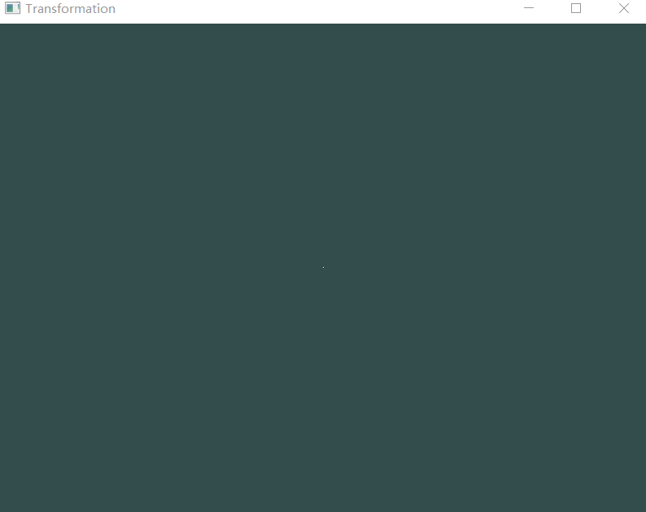

# 计算机图形学HW8
姓名：陈谱一    学号：16340026
## Basic:
1. 用户能通过左键点击添加Bezier曲线的控制点，右键点击则对当前添加的最后一个控制点进行消除.
2. 工具根据鼠标绘制的控制点实时更新Bezier曲线。

**基本概念**

Bezier曲线本质上是由调和函数根据控制点的插值来生成的，其参数方程如下：


上式为n次多项式，其中Pi表示特征多边形的n + 1个顶点向量，B(t)为伯恩斯坦基函数，表达式为：


**左右键点击函数**

左右键的点击响应写在一个click_callback函数中，通过glfwSetMouseButtonCallback来调用。用一个vector存储点的横纵坐标，每点击左键就向vector中push一次。每次按右键就把容器中末尾的坐标erase，代码如下：
```
//鼠标左键点击
if (glfwGetMouseButton(window, GLFW_MOUSE_BUTTON_LEFT) == GLFW_PRESS) 
{
	glm::vec2 p = glm::vec2(x, y);
	points.push_back(p);
}
//鼠标右键点击
if (glfwGetMouseButton(window, GLFW_MOUSE_BUTTON_RIGHT) == GLFW_PRESS)
{
	vector<glm::vec2>::iterator iter;
	int i = 0;
	for (iter = points.begin(), i = 0; iter != points.end(); ++iter, ++i) {
		if (i == points.size() - 1)
			points.erase(iter);
	}
}
```

**生成直线和曲线**

生成直线和曲线的代码写在循环中，因为要实时更新点、直线和曲线的状态。用vertices和curve两个数组来存储points的坐标。比较复杂的是生成曲线的函数，需要用上述的公式，另外写一个阶乘函数便于使用公式：
```
//生成曲线
float t, curveX = 0, curveY = 0;
int n = points.size() - 1;
for (t = 0; t < 1; t += 0.001) {
	for (int i = 0; i <= n; i++) {
		float b = Factorial(n) / (Factorial(i) * Factorial(n - i))
			* pow(t, i) * pow(1 - t, n - i);
		curveX = curveX + b * points[i].x;
		curveY = curveY + b * points[i].y;
	}
	curve[ccount * 2] = curveX;
	curve[ccount * 2 + 1] = curveY;
	curveX = 0;
	curveY = 0;
	ccount++;
}
```
直线和曲线分别要写VAO和VBO来显示在屏幕上，和之前的作业类似，这里不贴代码。

## Bnous:
1. 可以动态地呈现Bezier曲线的生成过程。

动态生成主要用到了递归的方法，我定义的是在点击四个点或以上时动态显示。显示过程和直线类似，将点存储在一个新的数组中。递归实现动态过程：
```
if (v.size() == 1) return;
vector<glm::vec2> next = vector<glm::vec2>();
for (int i = 0; i < v.size() - 1; i++) {
	dynamicVertices[i * 2] = v[i].x + check * (v[i + 1].x - v[i].x);
	dynamicVertices[i * 2 + 1] = v[i].y + check * (v[i + 1].y - v[i].y);
	next.push_back(glm::vec2(dynamicVertices[i * 2], dynamicVertices[i * 2 + 1]));
}
//VAO和VBO
...
dynamic(next);
```
最后的结果如下：


